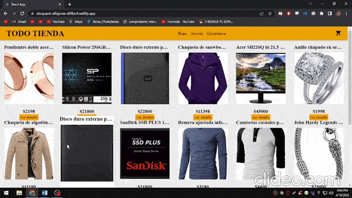

<div align="center"> 

<h1 align="center"> Proyecto E-Commerce Coderhouse </h1>

[](https://app.netlify.com/sites/bucolic-sunshine-01b455/deploys)

<h4>
    <a href="https://bucolic-pothos-2953d0.netlify.app/">Ver Demo</a>
</h4>

</div>

# :notebook_with_decorative_cover: Tabla de Contenido

  - [:camera: Screenshots](#camera-screenshots)

  - [:space_invader: Tecnologías usadas](#space_invader-tecnologías-usadas)

  - [Comenzando con el proyecto.](#comenzando-con-el-proyecto)
    - [Prerequisitos](#prerequisitos)
    - [:running: Correr el proyecto localmente](#running-correr-el-proyecto-localmente)

### :camera: Screenshots

<div align="center"> 
  
</div>

## :space_invader: Tecnologías usadas

* [React.js](https://reactjs.org/)
  * React es una biblioteca Javascript y fue la tecnologia aprendida en este curso.
* [React Router](https://reactrouter.com/)
  * Utilice esta librearía para poder obtener un enrutamiento dinámico.
* [Create React App](https://create-react-app.dev/)
  * Este proyecto se construyó usando Create React App.
* [Firebase](https://firebase.google.com/)
  * Firebase es una plataforma para el desarrollo de aplicaciones web y aplicaciones móviles. La misma ofrece un servicio de hosting completamente administrado para microservicios y contenido estático y dinámico. Cuenta con el respaldo del almacenamiento SSD y una CDN (red de entrega de contenido) global. Firebase Hosting incluye SSL sin necesidad de configuración para que el contenido se publique siempre de forma segura. 
* [Netlify](https://www.netlify.com/)
  * Netlify es una herramienta de hosting que me permitió hacer un deploy del proyecto
* [react-toastify](https://www.npmjs.com/package/react-toastify)
  * React-Toastify me permitio agregar notificaciones al proyecto con facilidad.

## Comenzando con el proyecto.

Clonar el proyecto:

```bash
git clone https://github.com/Juangadis/proyectoReact
```

Ir al directorio del proyecto:

```bash
  cd app
```

Instalar las dependencias:

```bash
  npm install
```

Correr el servidor:

```bash
  npm start
```